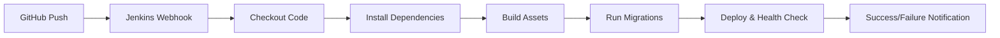

# 🚀 Jenkins CI/CD Setup untuk Laravel 12 + Vite

## 📋 Prerequisites

- Docker & Docker Compose terinstall
- Repository GitHub: `https://github.com/Rofiq02bae/nangkring.git`
- Jenkins sudah running di `http://localhost:8080`

## 🔧 Langkah-langkah Setup Jenkins

### 1. **Initial Setup Jenkins**

1. Akses Jenkins di `http://localhost:8080`
2. Masukkan initial admin password:
   ```bash
   docker exec laravel-jenkins-app-jenkins-1 cat /var/jenkins_home/secrets/initialAdminPassword
   ```
3. Pilih **"Install suggested plugins"**
4. Buat admin user baru atau skip untuk menggunakan admin default
5. Konfirmasi Jenkins URL: `http://localhost:8080/`

### 2. **Install Plugin yang Diperlukan**

1. Go to **Manage Jenkins** → **Manage Plugins**
2. Install plugins berikut:
   - **GitHub Integration Plugin**
   - **Docker Pipeline Plugin** 
   - **Pipeline Plugin** (biasanya sudah terinstall)
   - **Git Plugin** (biasanya sudah terinstall)

### 3. **Setup GitHub Credentials**

1. Go to **Manage Jenkins** → **Manage Credentials**
2. Click **"(global)"** → **"Add Credentials"**
3. Pilih **"Username with password"**
4. Isi:
   - **Username**: Username GitHub Anda
   - **Password**: Personal Access Token GitHub
   - **ID**: `github-credentials`
   - **Description**: `GitHub Access Token`

#### 📝 Cara Membuat GitHub Personal Access Token:
1. Go to GitHub → **Settings** → **Developer settings** → **Personal access tokens** → **Tokens (classic)**
2. Click **"Generate new token"**
3. Pilih scopes:
   - ✅ `repo` (Full control of private repositories)
   - ✅ `workflow` (Update GitHub Action workflows)
4. Copy token yang dihasilkan

### 4. **Buat Pipeline Job**

1. Di Jenkins dashboard, click **"New Item"**
2. Masukkan nama: `Laravel-Vite-Pipeline`
3. Pilih **"Pipeline"** → **OK**

### 5. **Konfigurasi Pipeline**

#### **General Tab:**
- ✅ Check **"GitHub project"**
- **Project URL**: `https://github.com/Rofiq02bae/nangkring/`

#### **Build Triggers:**
- ✅ Check **"GitHub hook trigger for GITScm polling"**
- ✅ Check **"Poll SCM"** dengan schedule: `H/5 * * * *` (polling setiap 5 menit)

#### **Pipeline Tab:**
- **Definition**: `Pipeline script from SCM`
- **SCM**: `Git`
- **Repository URL**: `https://github.com/Rofiq02bae/nangkring.git`
- **Credentials**: Pilih `github-credentials`
- **Branch Specifier**: `*/main`
- **Script Path**: `laravel-jenkins-app/Jenkinsfile`

### 6. **Setup GitHub Webhook (Optional)**

#### Di GitHub Repository:
1. Go to **Settings** → **Webhooks** → **Add webhook**
2. **Payload URL**: `http://your-jenkins-url:8080/github-webhook/`
3. **Content type**: `application/json`
4. **Which events**: `Just the push event`
5. ✅ **Active**

### 7. **Test Pipeline**

1. Click **"Build Now"** di job yang sudah dibuat
2. Monitor **Console Output** untuk melihat progress
3. Pipeline akan menjalankan stages:
   - 🔄 **Checkout**: Clone repository
   - 📦 **Dependencies**: Install composer & npm packages
   - 🏗️ **Build**: Compile Vite assets
   - 🗄️ **Migrate**: Run database migrations
   - 🚀 **Deploy**: Restart Laravel container

## 📊 Pipeline Flow



## 🔍 Monitoring & Troubleshooting

### **Melihat Logs Container:**
```bash
# Laravel app logs
docker logs laravel-jenkins-app-app-1

# Jenkins logs
docker logs laravel-jenkins-app-jenkins-1

# MySQL logs
docker logs laravel-jenkins-app-db-1
```

### **Masuk ke Container untuk Debug:**
```bash
# Laravel container
docker exec -it laravel-jenkins-app-app-1 bash

# Jenkins container
docker exec -it laravel-jenkins-app-jenkins-1 bash
```

### **Restart Services:**
```bash
# Restart semua services
docker-compose down && docker-compose up -d

# Restart hanya Laravel app
docker-compose restart app
```

## 🎯 Environment Variables

Jika diperlukan, tambahkan environment variables di Jenkins:
1. **Manage Jenkins** → **Configure System**
2. **Global Properties** → **Environment variables**
3. Tambahkan:
   - `APP_ENV=production`
   - `APP_DEBUG=false`
   - `DB_HOST=db`
   - `DB_DATABASE=laravel`

## 🔐 Security Best Practices

1. **Ganti default credentials** setelah setup
2. **Gunakan Personal Access Token** bukan password GitHub
3. **Limit access** ke Jenkins hanya untuk IP yang diperlukan
4. **Backup Jenkins configuration** secara berkala
5. **Update Jenkins & plugins** secara berkala

## 📱 Notifications (Optional)

Untuk mendapatkan notifikasi build:
1. Install **Email Extension Plugin** atau **Slack Notification Plugin**
2. Konfigurasi di **Manage Jenkins** → **Configure System**
3. Tambahkan notification di pipeline `post` section

---

✅ **Setup selesai!** Pipeline Jenkins siap untuk CI/CD Laravel 12 + Vite dengan automatic deployment.
